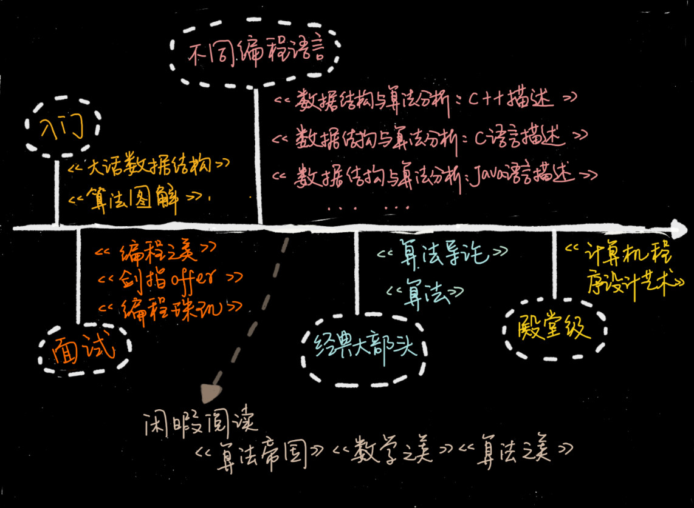

# 笔记

> <https://github.com/wangzheng0822/algo>

## 书籍

## 03 复杂度分析

### 复杂度量级

- 常量阶 O(1)
- 对数阶 O(logn)
- 线性阶 O(n)
- 线性对数阶 O(nlogn)
- 平方阶 O(n2)
- 立方阶 O(n3)
- 指数阶 O(2^n)
- 阶乘阶 O(n!)

- 均摊时间复杂度一般等于最好情况时间复杂度

## 05 数组

- 线性表
- 数组适合查找(下标查找, 而不是普通查找)
  - 支持随机访问(地址连续), 根据下标访问O(1)
  - 排序好的查找操作O(logn)
- 插入、删除操作平均O(n)

### 字节序

- 大端模式: 人类阅读模式, 高位高字节
- 小端模式: 利于某些计算机处理场合, 地位高字节

    # 0x1234()
    # 0x101 0x102
      12    34      # 大端模式
      34    12      # 小端模式

## 06 链表

- 时间复杂度
  - 查找O(n)
  - 插入/删除O(1)
- 循环链表
  - 约瑟夫问题
- 双向链表deque(double-end-queue)
  - 在指定节点前插入, 比单链表优势O(1)
  - 空间换时间(例子: 缓存)

## 07 链表练习

- 使用哨兵(头指针)简化判断
- 留意边界条件处理
  - 链表为空
  - 只包含一个节点
  - 只包含2个节点
  - 处理头尾节点
- 画图辅助

- 单链表反转(206)
- 链表环检测(141)
- 两个有序链表合并(21)
- 删除链表倒数第n节点(19)
- 求链表中间节点(876)

## 08 栈

## 09 队列

- 线程安全的队列叫做`并发队列`, 利用CAS原子操作, 可以实现高效并发队列(无锁队列)
- CAS, 在入队前，获取tail位置，入队时比较tail是否发生变化，如果否，则允许入队，反之，本次入队失败。出队则是获取head位置，进行cas。

## 10 递归

- 是否可以递归
  - 问题的解可以分解为几个子问题的解。何为子问题？就是数据规模更小的问题
  - 问题与子问题，除了数据规模不同，求解思路完全一样
  - 存在递归终止条件
- 编写关键
  - 找到将大问题分解为小问题的规律
  - 写出递推公式, 假设子问题已经解决, 不深入
  - 推敲终止条件
  - 翻译代码
- 注意重复计算

## 12 排序(归并, 快排)

- 分治思想, 递归实现
- 归并
  - 稳定
  - 非原地算法(不占额外空间)
  - 时间复杂度O(nlogn)
- 快排
  - 不稳定
  - 原地排序算法
    - 分区函数
  - 时间复杂度O(nlogn), 最差(已排序)O(n**2)

## 13 线性排序

- 由于均为O(n), 所以叫线性排序
- 非基于比较的算法, 不涉及元素之间比较操作
- 桶排序(Bucket Sort)
  - O(nlog(n/m)): m个桶内部快排, 当桶个数趋近排序数据个数, 接近O(n)
  - 桶间有天然大小关系
  - 适合外部排序(数据在外部磁盘中, 数据量大, 内存小)
  - 如果单个桶数据量任然很大, 递归桶排序
- 计数排序(Counting Sort)
  - 桶排序特殊情况(桶内区间为1, 省掉内部排序时间)
  - 如高考排名, 751个桶
  - 原理
    - 先桶排序得出每个桶内个数, 该数组为C[]
    - 再顺序求和, 每个桶内为前n项和, 数组B[c+]
    - 从原始序列A[]末尾(n-1)依次插入(倒序保证稳定)
    - 由 A[n-1]=a 的值找到B[a]对应的值, 插入最终数组D[b]
    - 累加数组该位置值减一, 指向前一D[]可插入位置, B[a] += 1
  - 要求
    - 适用于数据范围不大的场景
    - 只能非负整数, 如果为其他值需要转换, 负数加, 小数乘
- 基数排序(Radix Sort)
  - 要求
    - 数据需要可以分割出独立的位比较, 位间有递进关系, 如手机号排序
    - 每位数据范围不能太大, 因为要用线性排序算法
    - 线性排序必须稳定(下层需要使用归并排序)
    - 数据可以对齐(相同长度), 否则需要补齐位数
  - 复杂度, O(k*n), k位, 每位用线性排序, k有限, 则最终为O(n)
