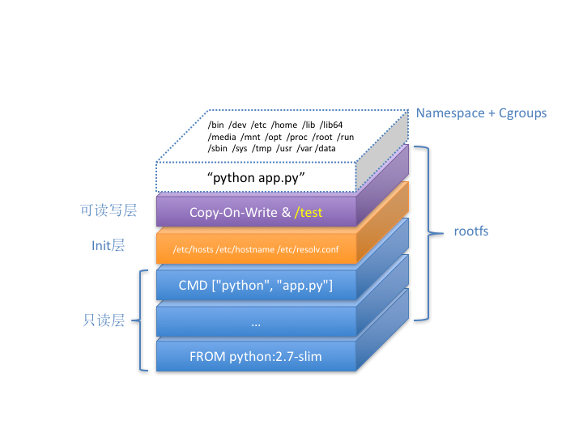

# 深入剖析Kubenetes

## 05 容器基础1: 进程

> 容器, 特殊的进程

- 容器技术的核心功能, 就是通过约束和修改进程的动态表现, 从而为其创造出一个'边界'
  - Cgroup, 制造约束
  - Namespace, 修改进程视图
    - PID Namespace, 其只是系统创建线程的系统调用`clone()`的可选参数(Linux的线程是用进程实现的)
    - Mount Namespace
    - User Namespace
    - Network Namespace
    - etc

## 06 容器基础2: 隔离与限制

- 敏捷和高性能是优势
- 隔离的不彻底
  - 只是特殊进程, 多个容器间使用相同宿主机内核(这也是为什么win和Mac不能用docker)
  - Linux内核中, 很多资源和对象是不能Namespace化的, 典型如时间
- Linux Cgroups(Linux Control Group), 限制进程组使用的资源上限
  - `/sys/fs/cgroups`目录下的各资源子目录(如`./cpu`)下创建文件夹(如./docker), 写入限制值
  - `tasks`文件中为PID, 指明目标
  - 限制进程在长度为`cfs_period`的一段时间内，只能被分配到总量为`cfs_quota`的 CPU 时间
  - 容器对内存等资源隔离不彻底(`/proc`不知道`Cgroups`存在), 解决方法使用`lxcfs`给容器挂载修改后的内核信息
- Docker参数
  - `--cpu-period`, can not be less than 1ms (i.e. 1000)
  - `--cpu-quota`
  - `-m`, 内存限制, 如`100M`

## 07 容器基础3: 镜像

- 容器镜像: 即rootfs(根文件系统), 如Ubuntu18.04
- 容器层修改只读内容: `Copy-on-write`, 从上到下一次查找, 找到后复制到容器层, 然后修改

### Docker核心原理

- 启用Linux Namespace配置
- 设置指定的Cgroups参数
- 切换进程的根目录(优先使用`pivot_root`, 不支持用`chroot`)

> pivot_root是把整个系统切换到一个新的root目录，而移除对之前root文件系统的依赖，这样你就能够umount原先的root文件系统。而chroot是针对某个进程，而系统的其它部分依旧运行于老的root目录

### 联合文件系统（Union File System）

- 又叫UnionFS, 将多个不同位置的目录联合挂载(Union Mount)到同一目录下
- Ubuntu之前默认`aufs`, 现在使用`overlay2`(省略了fs后缀), Linux内核集成

``` sh
# 查看aufs挂载信息(mnt), 找到对应的aufs内部ID
cat /proc/mounts | grep aufs
xxxxxxxxxxxxxxxxxxxxxxxxxxxxx,si=xxxxx
# 查看被联合挂载的各层信息
cat /sys/fs/aufs/si_xxxxxxxxxxx/br[0-9]*
/var/lib/docker/aufs/diff/xxxxx     # 可读写层(rw)
                                    # Init层(ro+wh)
                                    # 只读层(ro+wh)
```

### aufs

- 只读层
  - rootfs最下面的几层, ro+wh(readonly+whiteout)
- 可读写层
  - 最上面一层, rw, 在没有写入文件前, 目录空
  - 删除文件, 创建`.wh.<name>`文件, 联合挂载后, 原文件被遮挡(即消失), 即whiteout(白障)
- Init层
  - 以`-init`结尾的层, 专门用来存放`/etc/hosts`等内容
  - 其原属于镜像只读, 但是需要启动时修改满足功能, 但是不希望docker commit提交此类修改, 所以单独挂载

### overlay2

/var/lib/docker/overlay2

- `LowerDir`, 镜像层
- `UpperDir`, 容器层, 创建文件后, 出现在此目录
- `MergedDir`, 容器挂载点, lower和upper联合挂载后, 作为root提供给容器
- `WorkDir`, 用于实现`Copy-on-write`

## 08 容器基础4: 容器

``` sh
# 查看容器PID
docker inspect --format '{{ .State.Pid }}' <conID>
# 查看容器Namespace
ls -l /proc/<pid>/ns
```

### ENTRYPOINT

- 和CMD都是容器进程启动所必需的参数
- 完整执行格式`ENTRYPOINT CMD`
- 默认提供隐含值, `/bin/sh -c`, 最后执行`/bin/sh -c "python abc.py"`, CMD即为ENTRYPOINT的参数

### docker exec

原理, 创建进程通过加入容器已有的namespace

- 通过`open()`系统调用打开Namespace
- 把文件描述符`fd`交给`setns()`使用
- `setns`执行后当前进程就加入了ns

### Volume

- 联合挂载在`/mnt/`下, 即`rootfs` ready
- 在执行chroot前, 挂载指定目录到`mnt`下对应目录
- 挂载时容器进程(dockerinit)已创建, Mount Namespace已生效, 挂载只在容器内可见, 保证隔离性不会被Volume破坏
  - 此处的容器进程, 是Docker创建的一个容器初始化进程(dockerinit), 不是应用进程(ENTRYPOINT+CMD)
  - dockerinit会负责完成根目录准备, 挂载设置和目录, 配置hostname等
  - 最后, 通过`execv()`系统调用, 让应用进程取代自己, 成为PID=1的进程
- 使用绑定挂载(bind mount)机制
  - 实际是一个`inode`替换过程, 绑定相当于修改'指针'指向
  - `inode`, 存放文件的'对象'
  - `dentry`, 目录项, 访问inode的'指针'


### '全景图'



## 09 Kubernetes的本质

### 全局架构


- Master(控制节点)
  - `kube-apiserver`, API服务
  - `kube-scheduler`, 调度
  - `kube-controller-manager`, 容器编排
  - `Etcd`, 集群的持久化数据, 由`kube-apiserver`处理后存入
- Node(计算节点)
  - `kubelet`, 负责同容器运行时(如Docker)交互
    - 依赖`CRI`远程调用接口, (Container Runtime Interface), 接口定义了容器运行的核心操作
    - 容器运行时(Docker)通过`OCI`与Linux交互
    - 通过`gRPC`协议与`Device Plugin`插件交互, 管理GPU等宿主机物理设备
    - `CNI`(Container Networking Interface), 网络插件, 配置容器网络
    - `CSI`(Container Storage Interface), 存储插件, 持久化存储

### 核心功能全景图


- 最主要的设计思想是, 从更宏观的角度, 以统一的方式来定义任务之间的各种关系, 并且为将来支持更多种类的关系留有余地
- 编排, 按照用户的意愿和整个系统的规则, 完全自动化地处理容器间的各种关系
- 容器间关系
  - `Pod`, 之中的容器共享一个Network Namespace, 同一组数据卷
  - `Service`, 作为Pod的代理入口(Portal), 代替Pod对外暴露一个固定的网络地址
  - `Deployment`, 多实例管理器, 一次启动多个应用实例
  - `Secret`对象, 保存在Etcd中的键值对数据, 容器启动时, 以Volume方式挂载到容器内
- 应用运行形态
  - `Job`, 一次性任务
  - `DaemonSet`, 每个宿主机上只运行一个副本的守护进程服务
  - `CronJob`, 定时任务
- 使用方式:　声明式API，对应的以下对象为API对象
  - 通过一个'编排对象', 比如Pod Job CronJob等, 描述管理的应用
  - 在为它定义一些'服务对象', 比如Service Secret Horizontal-Pod-Autoscaler等, 负责具体的平台级功能

## 10 kubeadm

- kubeadm init
  - 检查是否可以部署(Preflight Checks)
  - 生成Kubernetes对外提供服务所需的各种证书和对应的目录
    - 除非专门开启'不安全模式', 默认都需要HTTPS
    - 证书位置, Master下`/etc/kubernetes/pki`
    - 项目证书ca.crt和私钥ca.key
    - kubelet进行streaming操作, 需要通过访问kube-apiserver, 使用的证书`apiserver-kubelet-client.crt`和`xx.key`
    - 可以拷贝现有证书到该目录下, 使kubeadm跳过生成步骤
  - 生成其他组件访问kube-apiserver所需的配置文件
    - `/etc/kubernetes/xxx.conf`
      - admin.conf
      - controller-manager.conf
      - kubelet.conf
      - scheduler.conf
    - 记录Master节点服务器地址, 监听端口, 证书目录等
  - 为Master组件生成Pod配置文件(Static Pod), kubelet启动后会自动检查, 加载所有的Pod YAML, 运行
    - `/etc/kubernetes/manifests`
    - kube-apiserver
    - kube-controller-manager
    - kube-scheduler
  - 生成Etcd的Pod YAML
  - Master容器启动后, kubeadm检查localhost:6443/healthz检查, 等待完全加载
  - 生成`bootstrap token`
  - 将ca.crt等Master节点信息, 通过ConfigMap方式(cluster-info)保存在Etcd中, 工后续部署Node使用
  - 安装默认插件
    - kube-proxy[必装], 提供集群的服务发现
    - DNS[必装], DNS解析
- kubeadm join
  - 使用token, 获取证书(CA文件), 用来和apiserver交互, 获取cluster-info内的信息
- 配置kubeadm的部署参数
  - `kubeadm init --config kubeadm.yml`
  - 修改配置文件

## 11 从0搭建k8s集群

- 默认情况下, Master节点不允许运行用户的Pod
- 通过Taint(污点)/Toleration机制
- 原理, 某节点打上Taint, 所有Pod都不能在该节点上运行, Pod有'洁癖'
- 除非个别Pod声明自己能'容忍'该'污点', 即声明了Toleration, 才能在该节点运行
- 加污点, `kubectl taint nodes node1 foo=bar:NoSchedule`
- Taint只对之后调度的Pod生效, 不影响之前的
- 删除键为xx的污点, `kubectl taint nodes --all node-role.kubernetes.io/master-`, 末尾加`-`
- 云原生, 即Kubernetes原生

## 12 部署一个应用

``` yml
apiVersion: apps/v1
kind: Deployment
metadata:
  name: nginx-deployment
spec:
  selector:
    matchLabels:
      app: nginx
  replicas: 2
  template:
    metadata:
      labels:
        app: nginx
    spec:
      containers:
      - name: nginx
        image: nginx:1.8
        ports:
        - containerPort: 80
        volumeMounts:
        - mountPath: "/usr/share/nginx/html"
          name: nginx-vol
      volumes:
      - name: nginx-vol
        emptyDir: {}
```

- YAML文件, 在k8s中, 即为一个API Object(API对象)
- `Deployment`, 是一个定义多副本应用的对象
- Pod模板(spec.template)
- Pod就是k8s世界里的应用, 而一个应用, 可以由多个容器组成
- 控制器模式(controller pattern), 使用API对象(Deployment)管理另一种API对象(Pod)的方法
- `Metadata`字段, API对象的'标识', 即元数据, 也是k8s中找到这个对象的主要依据
  - 最主要是`Labels`字段, 一组kv格式的标签(如`app: nginx`)
  - 使用Labels字段过滤被控制对象
  - 过滤规则定义`spec.selector.matchLabels`, 即`Label Selector`
  - `Annotations`, 与Labels格式/层级完全相同, 用来携带内部信息(k8s自身使用), 大部分是自动添加
- API对象定义, 2部分
  - Metadata, 存放对象的元数据, 所有API对象, 基本一致
  - Spec, 属于该对象独有的定义, 用来描述其要表达的功能
- 过滤命令, `kubectl get pods -l app=nginx`, 命令行中, 标签使用`=`, 而不是`:`
- describe的`Events(事件)`中包含详细信息, debug时有用
- 全程推荐使用`kubectl apply -f x.yml`, k8s根据YAML内容自动具体处理
- 如果实例只有一个, 推荐`replicas=1`的Deployment, 而不是单独的Pod, 因为前者在Node挂掉后仍可调度到其他Node
